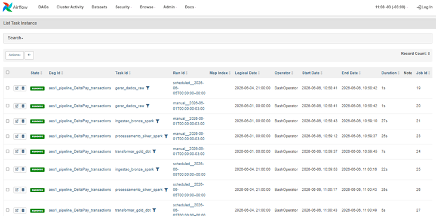
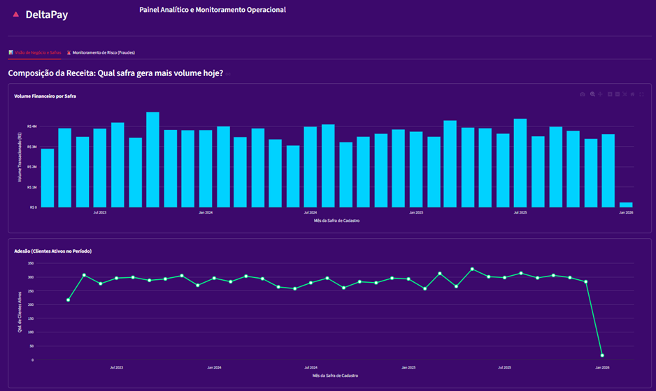
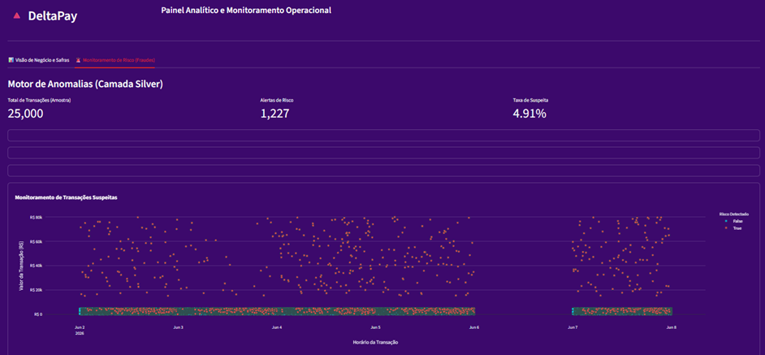

# 🚀Analytics Engineering Stack 1 (AES1)


[]()
[]()
[]()
[]()
[]()
[]()
[]()
[]()

## 🎯 1. O Objetivo
O objetivo deste projeto é demonstrar meu conhecimento de implementação e uso de uma arquitetura de dados moderna (Modern Data Stack) de ponta a ponta em um caso simples de analise de dados. 

Através do uso integrado de ferramentas padrão de mercado (Spark, Delta Lake, dbt e Airflow) este repositório ilustra a implementação de uma pipeline de dados robusta, isolada em containers e reprodutível.

Como o foco técnico aqui reside na Engenharia de Dados e na orquestração da esteira (da extração à modelagem Gold), foi utilizada uma base de dados simplificada para facilitar a execução local por qualquer avaliador. 

Para demonstração das minhas habilidades em modelagens analíticas mais complexas e criação de dashboards avançados, convido-o a explorar os outros projetos do meu portfólio. 

## 📖 2. O cenário 

A DeltaPay é uma fintech de pagamentos em fase de crescimento.  
Diariamente, seus sistemas geram um grande volume de dados brutos contendo informações sobre transações financeiras, cadastros de clientes e telemetria de dispositivos.

Para apoiar a estratégia da diretoria e o monitoramento da equipe de operações, a empresa precisa organizar esse histórico de dados e responder a duas perguntas centrais de negócio:

Composição da Receita e Retenção:  
Qual grupo de clientes (safra de cadastro) gera o maior volume financeiro atualmente?  
A empresa está conseguindo manter o engajamento dos usuários mais antigos?  

Monitoramento de Risco (Fraudes):  
Como identificar rapidamente transações suspeitas ou anômalas, cruzando o valor atual transacionado com o histórico financeiro do cliente?

O objetivo deste projeto mé ostrar como estruturar esses dados brutos, do momento em que são gerados até a sua exibição final, construindo um painel analítico focado em responder a essas exatas perguntas de forma clara e automatizada utilizando uma stack moderna e escalável durante todo este processo. 

## 🏗️ 3. A Arquitetura (MDS - Modern Data Stack)
  

A esteira de dados foi desenhada seguindo a arquitetura Medallion (Bronze, Silver, Gold), orquestrada pelo **Apache Airflow**:  

1. **Camada Bronze (Ingestão Bruta):**  
   Um script em Python simula a extração de dados de um sistema transacional (ERP/CRM), gerando arquivos `.json` particionados por data de execução.  
2. **Camada Silver (Processamento):**  
   O motor do **PySpark** lê os dados brutos, aplica tipagem rigorosa, limpeza de anomalias e salva no formato **Delta Lake**, garantindo operações ACID (idempotência via `overwrite` com `replaceWhere`).
3. **Camada Gold (Analytics):**  
   O **dbt (Data Build Tool)** entra em cena usando o motor do **DuckDB** para ler os arquivos Parquet da Silver e aplicar as regras de negócio em SQL puro, gerando agregações e KPIs.
4. **Exportação BI:**  
   Uma tarefa automatizada extrai os dados do DuckDB para um formato otimizado (`.csv`) de leitura para o **Tableau**.

### Decisões Técnicas (oor que estas ferramentas?)
* **Docker:**  
Para garantir que o ambiente seja reprodutível em qualquer máquina sem "sujar" o sistema operacional do host.
* **Apache Spark + Delta Lake:**  
Escolhido pela capacidade de processamento distribuído. O formato Delta foi essencial para permitir regravações seguras (idempotência) sem duplicar dados em execuções repetidas.
* **dbt + DuckDB:**  
Uma ótima combinação para Analytics Engineering local. 
O DuckDB oferece a performance de um Data Warehouse Cloud (como Snowflake/BigQuery) rodando de forma *serverless* e nativa em cima de arquivos Parquet.
* **streamlit**  
Escolhido porque um dashboard complexo não é uma prioridade neste projeto, ele servirá apenas para exemplificar o consumo dos dados gerados pela pipeline. 
Neste contexto o Streamlit cupre muito bem este papel pois é rápido e prático pra desenvolvimentos meias simples e direto ao ponto.   

## 🗄️ 4. Os dados 
Os dados processados neste projeto são inteiramente fictícios e foram modelados para simular as transações diárias de uma Fintech de aplicativo de carteira digital.

Para tornar esta arquitetura 100% autossuficiente e dinâmica, optei por não utilizar arquivos estáticos (como datasets baixados do Kaggle). 

Em vez disso, desenvolvi um passo preliminar na própria orquestração que consiste em um script em Python que atua como o sistema da empresa que gera os dados operacionais diários.

Em cada execução diária, o Airflow aciona este gerador passando a data exata da execução.   
O script então cria "na hora" as transações daquele dia específico na camada raw (pasta "pipeline/raw").

Isso garante que a pipeline seja retroalimentada constantemente, deixando sempre um novo dia de dados pronto e fresco para ser consumido, limpo e transformado pelas camadas seguintes.

### Modelo dos dados originais (raw)


### Modelo dimensional (Gold)


### Transformações realizadas: 

**Modelagem de Dimensões:**  
Extração e separação das entidades descritivas nas tabelas dim_users, dim_devices e dim_time.  
É nesta etapa que derivo regras analíticas cruciais, como o cálculo da Safra de Cadastro (safra_mes) a partir da data de criação da conta do cliente.

**Construção da Tabela Fato de transações:**  
Criação da fact_transactions como a tabela central e granular do modelo. 
Ela armazena as métricas quantitativas (valor das transações, indicadores de anomalia) e as chaves estrangeiras que a conectam de forma eficiente às dimensões.

**Integridade e Otimização:**  
Padronização final de tipos de dados, garantia de integridade referencial entre os IDs e otimização da estrutura para que as consultas (queries) feitas pelo dashboard no DuckDB sejam ágeis e precisas.

## ⚙️ 5. A Pipeline
  

A pipeline é orquestrada de ponta a ponta pelo Apache Airflow, processando os dados de forma diária e idempotente através das seguintes etapas:

**Raw (Ingestão):**  
Recepção dos eventos transacionais brutos e fortemente aninhados, armazenados no Data Lake no formato JSONL.

**Bronze e Silver (Processamento com Spark):**  
O Apache Spark assume a carga pesada para ler os arquivos JSONL, achatar (flattening) as estruturas complexas, mascarar dados sensíveis (PII/LGPD) e calcular as primeiras flags de anomalia, salvando o resultado em formato colunar otimizado (Parquet).

**Gold (Modelagem com dbt + DuckDB):**  
O dbt entra em ação para transformar os dados limpos da camada Silver em um modelo dimensional (Star Schema). O processamento ocorre diretamente no DuckDB, garantindo altíssima performance para consultas analíticas.

**Consumo (Streamlit):**  
O ciclo se encerra com um aplicativo interativo construído em Python, que se conecta ao banco DuckDB (Gold) para fornecer as respostas de negócio e os alertas operacionais de forma visual.

## 📊 6. Resultados

Aqui faço uma análise dos dados observados no dashboard gerado pelo projeto alinhada com as perguntas a serem respondidas. 

### Composição da Receita e Retenção
  

#### **Qual grupo de clientes (safra de cadastro) gera o maior volume financeiro atualmente ?**  
A receita da empresa não é dependente de uma "safra de ouro" isolada, apresentando uma composição altamente diversificada e saudável.  
Os dados revelam uma contribuição financeira consistente e distribuída de maneira uniforme ao longo do tempo.  
Grupos de clientes cadastrados desde meados de 2023 até o final de 2025 mantêm volumes de transação muito próximos, orbitando solidamente a faixa de R$ 3 milhões a R$ 4 milhões por safra.

#### A empresa está conseguindo manter o engajamento dos usuários mais antigos?
O engajamento de longo prazo é um dos maiores destaques da operação.  
O número de usuários ativos provenientes das safras mais antigas (2023 e início de 2024) mantém-se no mesmo patamar elevado das safras mais recentes, oscilando de forma estável entre 250 e 320 clientes ativos por grupo.  
Isso comprova uma excelente taxa de retenção (baixo churn): 
os clientes adquiridos há mais de dois anos continuam utilizando a plataforma com a mesma frequência dos novos usuários.  
**Obs:** *A queda pontual observada na extrema direita do gráfico reflete apenas a safra do mês corrente, que ainda está em estágio inicial de formação.*

### Monitoramento de Risco (Fraudes): 
 

#### Como identificar rapidamente transações suspeitas ou anômalas, cruzando o valor atual transacionado com o histórico financeiro do cliente?
Em uma amostra recente de 25.000 transações, o sistema detectou com sucesso uma taxa de suspeita de 4,91% (1.227 alertas), perfeitamente destacadas em vermelho no gráfico de dispersão.

A identificação dessas fraudes ocorre em duas frentes perfeitamente visíveis no painel:

1 - **Valores anormais**  
Os pontos vermelhos isolados na parte superior do gráfico (atingindo até R$ 80 mil) evidenciam o bloqueio de valores atípicos de alto montante que fogem do padrão geral da plataforma.

2 - **Desvio de Comportamento**  
O pontos vermelhos localizados na densa faixa inferior do gráfico são transações de valores absolutos baixos mas que representarem um desvio brusco (acima de 3 vezes) em relação à média histórica daquele cliente específico ou por violação de velocidade (múltiplas transações em curtíssimo espaço de tempo).

Estas observações garantem que a DeltaPay não apenas possa tomar medidas de bloqueio de golpes milionários, mas também identifique fraudes sutis de invasão de conta, fornecendo precisão e velocidade para a tomada de decisão e medição dos resultados ao longo do tempo. 

## ⚙️ 7. Como Executar o projeto na sua máquina

Criei e executei o projeto utilizando Linux Debian via WSL2 do Windows 10.  
Esta é a configuração testada e recomendada. 

### Pré-requisitos

 

[]()  
Toda a infraestrutura restante vai rodar direto nos containeres Docker.  
*No caso de uso do "GitHub Desktop" e do "Docker desktop" abra estes aplicativos antes de prosseguir.* 

### 1. Clonar o repositório do GITHUB e entra na pasta do projeto
```git clone [https://github.com/sergiorib/AES1.git](https://github.com/sergiorib/AES1.git)```  
```cd AES1```

### 2. Instalar as dependências locais e isolar o ambiente  
```poetry install```  

**Obs:** *Necessário somente na primeira vez que for executar.*

### 3. Executar o script de SETUP do projeto 
```poetry run python src/utils/aes1_setup.py```   

O resultado deve ser:  
[+] up 7/7  
 ✔ Image docker-airflow-init            Built  
 ✔ Image docker-airflow-webserver       Built  
 ✔ Image docker-airflow-scheduler       Built  
 ✔ Container docker-airflow-init-1      Exited  
 ✔ Container docker-airflow-webserver-1 Started  
 ✔ Container docker-airflow-scheduler-1 Started  
 ✔ Container docker-postgres-1          Healthy  
✅ Comandos enviados ao Docker com sucesso!

**Obs1:** *O script irá criar a estrutura de pastas do DataLake e inicializar os containers Docker.*  
**Obs2:** *No Linux (ou WSL) execute como super-usuario. (su)

### 4. Executar a pipeline (Apache Airflow)
Acesse http://localhost:8082 para acessar o Airflow e acompanhar (ou rodar manualmente) a DAG **aes1_pipeline_DeltaPay_transactions** que irá executar o fluxo completo da pipeline. 

### 5. Ver o resultado (Dashboard Streamlit)  
```poetry run streamlit run src/app/aes1_dashboard.py --server.headless true```
abra o link http://localhost:8501 pra ver o dashboard.  

### Pra geração de outras datas (além da data corrente) 
No Airflow, basta clicar na seta de execução manual (botão 'Trigger DAG'), informar a data desejada, clicar em "trigger" e aguardar o processamento.   

### Problemas de permissão de pasta
No linux, caso tenha problemas de permissão execute:  
```chmod -R 777 <nome_pasta>```  
No local em que deu "permission denied" (pasta 'datalake' por exemplo). 

### Pastas e arquivos do projeto

AES1/
├── datalake/                 # Data Lake (Arquitetura Medalhão)
│   ├── bronze/               # Ingestão inicial
│   ├── gold/                 # DW Analítico (DuckDB)
│   ├── raw/                  # Arquivos transacionais brutos (.jsonl)
│   └── silver/               # Dados limpos e processados
├── doc/                      # Documentação e ativos visuais
├── src/                      # Código-fonte
│   ├── app/                  # Frontend (Streamlit)
│   │   ├── .streamlit/       # Configurações de layout
│   │   └── aes1_dashboard.py # App de visualização
│   ├── dags/                 # Fluxos de automação (Airflow)
│   │   └── aes1_pipeline.py  # Orquestração da esteira
│   ├── dbt_aes1/             # Projeto de transformação (dbt)
│   │   ├── models/           # Transformações SQL
│   │   ├── dbt_project.yml   # Configuração do projeto
│   │   └── profiles.yml      # Conexão com banco Gold
│   ├── scripts/              # Processamento e carga
│   │   ├── aes1_base_clientes.csv      # Dados mestres
│   │   ├── aes1_gerador_raw.py         # Ingestão de dados
│   │   ├── aes1_gerar_base_clientes.py # Gerador da base mestre
│   │   ├── aes1_ingestao_bronze.py     # Carga Bronze
│   │   ├── aes1_limpar_datalake.py     # Limpeza do ambiente
│   │   └── aes1_processamento_silver.py# Motor PySpark
│   └── utils/                # Infraestrutura de suporte
│       └── aes1_setup.py     # Automação de setup (Docker)
├── docker-compose.yaml       # Infraestrutura de Containers
├── poetry.toml               # Configurações do gerenciador de dependências
├── pyproject.toml            # Definições de dependências e ambiente
├── README.md                 # Documentação principal

📌Nota sobre Histórico de commits:  
Este projeto foi desenvolvido originalmente em [2025], mas foi migrado para este repositório público em [2026] para fins de exibição de portfólio, preservando o histórico real de commits e evolução do código.

## 📞 Contatos
Criado por **Sérgio Ribeiro Cerqueira**  
Fique à vontade para entrar em contato!

* [**Linkedin**](https://www.linkedin.com/in/sergio-ribeiro-cerqueira)
* [**Portfólio**](https://www.linkedin.com/in/sergio-ribeiro-cerqueira)
* **[Sergio.rib@live.com](sergio.rib@live.com)**